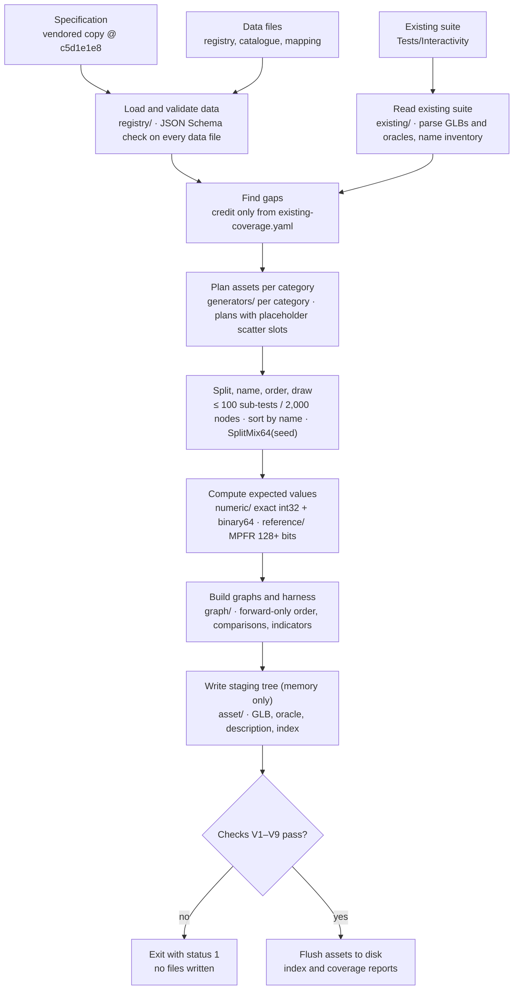
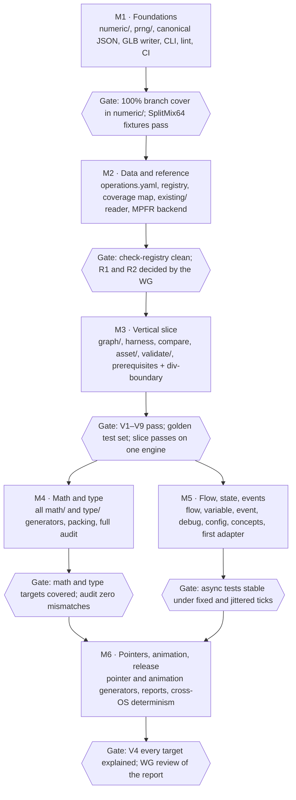

# KHR\_interactivity Supplemental Test Generator — TypeScript Project Specification

| | |
| --- | --- |
| Document status | Draft 0.3 |
| Date | 2026-10-05 |
| Requirements document | `Documents/KHR_interactivity_test_generator_spec.md` (Draft 0.3, 2026-10-05) |
| Author | Leonard Daly (Daly Realism) |

## 1. Overview

This project builds `khr-itest-gen`, a TypeScript/Node command-line generator that writes the supplemental KHR\_interactivity test assets defined in `Documents/KHR_interactivity_test_generator_spec.md` (the **requirements document**, Draft 0.3, 2026-10-05). The requirements document says *what* the generator must produce; this document says *how* to build it in TypeScript, module by module, so a team can plan, staff and accept the work from it alone.

**Goals**

- Produce about 130–150 supplemental assets and 1,300–1,600 sub-tests (requirements doc §1.9) that close every in-scope gap remaining at suite revision `9ffd30e` (§1.4–§1.6 and §10).
- Byte-identical output for identical inputs on Windows, macOS and Linux (§5.3).
- Assets that existing runners execute without changes (§4.3, §7.2, §7.4).
- Every requirement in the requirements document traceable to a module and a test (Appendix, section 19).

**Non-goals**

- Rejection tests or any asset expected to fail loading (§4.2).
- Changing, regenerating or fixing anything in the existing suite (§4.3, Appendix A item 7).
- A runtime for KHR\_interactivity. Adapters drive existing engines; they do not implement the extension.
- Merging the supplemental index into `test-index.json` (Appendix A item 4).

**Conventions.** MUST, SHOULD and MAY in bold capitals follow BCP 14, as in the requirements document. "§N" means a section of the requirements document; "section N" means a section of this document. Code identifiers are normative names for modules and types; implementers may add to them but not rename them without updating section 19.

## 2. Technology stack

The generator **MUST** run on Node.js active LTS (22 or later) and be written in TypeScript 5.x with `strict`, `noUncheckedIndexedAccess` and `exactOptionalPropertyTypes` enabled. Runtime dependencies are limited to the table below; each one is pinned to an exact version in `package-lock.json`, and the lock file is committed.

| Package | Role | Why this one |
| --- | --- | --- |
| `gmp-wasm` | 128-bit (configurable) MPFR reference arithmetic, section 7 | MPFR gives correctly rounded binary precision and every transcendental the Specification uses; WebAssembly needs no native build |
| `gltf-validator` | Khronos glTF Validator, §7.1 and §12 item 1 | The official validator, runs in-process on bytes |
| `ajv` (`Ajv2020` build) | KHR\_interactivity JSON schema validation, §7.1 | Supports JSON Schema 2020-12; schemas are vendored |
| `yaml` | Reads the target registry and coverage mapping | Human-reviewable data files (§10.1 informative note) |
| `commander` | CLI parsing, section 14 | Small, typed, no transitive dependencies |

Optional dependency for adapters only (section 16): `@khronosgroup/gltf-interactivity-engine`, the Apache-2.0 engine of the Khronos authoring tool, pinned like the others. If it is not yet published to npm, depend on a pinned git revision of `glTF-InteractivityGraph-AuthoringTool`. Generation never loads it.

Development dependencies: `vitest` (unit and golden tests), `fast-check` (property tests for numeric code), `eslint` with `@typescript-eslint`, `prettier`, `tsx` (run TS without a build step during development).

**Deliberately not used**

- `decimal.js` as the reference library: decimal working precision plus the ECMAScript 20-digit parsing caveat makes correct rounding to binary64 harder to prove than with MPFR. It remains the fallback if `gmp-wasm` proves unworkable (section 18).
- `@gltf-transform/core` for writing: the generator writes GLB bytes itself (section 11) so that byte layout, key order and padding are under its control. `@gltf-transform/core` **MAY** be used in tests to read assets back.

**No network.** Generation **MUST NOT** touch the network (§5.2). The KHR\_interactivity schemas, the Specification file and any WebAssembly binaries are vendored in the repository or resolved from `node_modules`. A test in CI runs the full generation with networking disabled.

## 3. Repository layout

The generator lives in a new top-level `Generator/` directory of `glTF-Test-Assets-Interactivity`, as one npm package. Data (registry, mappings, value tables) is kept apart from code so the working group can review it without reading TypeScript.

```
Generator/
├── package.json, package-lock.json, tsconfig.json, vitest.config.ts
├── data/
│   ├── registry/            # target registry, one YAML file per area (section 8)
│   │   ├── concepts.yaml  math.yaml  type.yaml  flow.yaml  variable.yaml
│   │   └── pointer.yaml  animation.yaml  event.yaml  debug.yaml  config.yaml
│   ├── existing-coverage.yaml   # existing sub-test -> target mapping (§11)
│   ├── operations.yaml          # 135 operation signatures, sockets, configs
│   ├── interpretations.yaml     # §9.5 reviewRequired interpretations
│   └── spec/                    # vendored Specification.adoc @ c5d1e1e8 + schemas
├── src/
│   ├── cli/                 # entry point, options (section 14)
│   ├── numeric/             # binary64, int32, spec math, formatting (section 5)
│   ├── prng/                # SplitMix64 (section 6)
│   ├── sampling/            # value classes and combination rules (section 6)
│   ├── reference/           # MPFR reference functions (section 7)
│   ├── registry/            # loaders and validators for data/ (section 8)
│   ├── existing/            # existing-suite reader, gap determination (section 9)
│   ├── graph/               # graph DSL, harness, comparison modes (section 10)
│   ├── asset/               # GLB, oracle, description, index writers (section 11)
│   ├── generators/          # one folder per category (section 12)
│   ├── validate/            # self-checks (section 13)
│   ├── report/              # coverage reports (section 13)
│   └── adapters/            # optional engine adapters (section 16)
├── test/                    # unit, property and golden tests (section 15)
│   └── golden/              # checked-in expected output for a reduced registry
└── tools/                   # one-off scripts, e.g. registry bootstrap from §1 tables
```

Rules:

- `src/` modules import only "downward" in the order of section 4; a lint rule (`import/no-restricted-paths`) enforces it.
- Nothing under `Tests/` or `Models/` is written by tests or by the generator unless the CLI output path points there explicitly.
- `.gitattributes` sets `* text eol=lf` for `Generator/` so golden files compare byte for byte on Windows.

## 4. Architecture

Generation is a single-process pipeline: load data, find gaps, plan, draw, compute, build, stage, check, and then flush. Every stage before the final one works in memory, which is how §5.5's "no partial output" rule holds.



The seed and limits enter at the planning stage. Adapters (section 16) run after the flush and never feed back into expected values.

**Module dependency order.** Each module imports only modules to its left: `numeric` → `prng` → `sampling` → `reference` → `registry` → `existing` → `graph` → `asset` → `generators` → `validate` → `report` → `cli`. `adapters` depends on `asset` and `numeric` only. The order is enforced by lint (section 3) and gives the build order of the milestones (section 17).

**Core data types passed between stages**

| Type | Produced by | Consumed by | Holds |
| --- | --- | --- | --- |
| `Registry` | `registry/` | gaps, generators, report | Targets, operation catalogue, interpretations |
| `Inventory` | `existing/` | gaps, naming, V5 | Existing sub-tests, names |
| `Target[]` (gaps) | gap determination | generators | In-scope targets with no existing credit |
| `AssetPlan` | generators | planner | Sub-tests with inputs (some as scatter slots), comparison, targets |
| `ResolvedAsset` | planner + expected values | graph builder | Final name, concrete inputs, expected values |
| `BuiltAsset` | graph + asset writers | validate, flush | GLB bytes, oracle text, description text, index entry |

## 5. Numeric core (`src/numeric/`)

All expected values and inline inputs pass through this module, so it is the one place where JavaScript's defaults and the Specification are reconciled. It has no dependencies and is the first module built and tested (section 17, M1).

### 5.1 Value model

```ts
type Int32 = number & { readonly __int32: unique symbol };   // always (x | 0) === x
type F64   = number;                                          // IEEE-754 binary64
type ValueType = 'bool' | 'int' | 'float' | 'float2' | 'float3' | 'float4'
               | 'float2x2' | 'float3x3' | 'float4x4' | 'ref';
type Value =
  | { t: 'bool'; v: boolean }
  | { t: 'int'; v: Int32 }
  | { t: 'float'; v: F64 }
  | { t: Exclude<ValueType, 'bool'|'int'|'float'|'ref'>; v: readonly F64[] } // Specification component order
  | { t: 'ref'; v: RefTarget };   // symbolic: null, node 3, delay of node 12, ...
```

`int(x)` is the only way to make an `Int32`; it throws unless `x` is an integer in \[−2^31, 2^31 − 1\]. References are symbolic (`RefTarget`) so descriptions can say "node 3" (§7.5) and the graph builder decides how to produce them.

### 5.2 int32 operations (`int32.ts`)

Each function implements the Specification's definition directly; none relies on JavaScript operator semantics without a test that proves they agree.

| Function | Implementation | Trap it avoids |
| --- | --- | --- |
| `add`, `sub` | `(a ± b) \| 0` | Exact: the sum of two int32 fits in binary64 |
| `mul` | `Math.imul(a, b)` | `a * b` loses low bits above 2^53 |
| `neg`, `abs` | `(-a) \| 0`; `abs` defined via `neg` | Gives −2147483648 for INT\_MIN (spec line 2510) |
| `div` | `Math.trunc(a / b) \| 0`, divisor 0 per spec definition | `INT_MIN / -1` wraps to INT\_MIN |
| `rem` | `(a % b) \| 0`, divisor 0 per spec | `-2147483648 % -1` is `-0` in JS; `\| 0` normalises it |
| `asr`, `lsl`, `lsr` | Explicit per-spec handling of counts outside 0–31 | JS masks counts to 5 bits |
| bitwise, `clz`, `ctz`, `popcnt` | Per spec, with `>>> 0` where unsigned | Sign extension surprises |

### 5.3 binary64 helpers (`f64.ts`)

JavaScript arithmetic (`+ - * /`, `Math.sqrt`, `Math.trunc`, `Math.floor`, `Math.ceil`, `Math.abs`) is correctly rounded binary64 and is used directly. Everything else is written from the Specification:

- `round`: away from zero at half-way, −0 for inputs in (−0.5, 0) (spec line 568). Computed as `t = Math.trunc(x); if (Math.abs(x - t) >= 0.5) t += Math.sign(x)`, then sign of zero restored. `x - t` is exact, so `0.49999999999999994` rounds to 0. `Math.round` is never used.
- `min`, `max`, `sign`, `fract`, `clamp`, `saturate`, `mix`: per the Specification's definition tables, including NaN and ±0 rows, not `Math.min`/`Math.max` behaviour.
- `isNegZero(x) = x === 0 && 1 / x < 0`; `nextUp`, `nextDown` via `DataView` bit manipulation (needed for §8.3 "one representable step either side").
- Transcendental expected values never come from `Math.sin` and friends; they come from section 7.

### 5.4 Number formatting (`format.ts`)

`formatF64(x)` produces the text for every float written to JSON, Markdown or a sub-test name (§5.4, §7.5):

1. NaN, ±Infinity: throws in graph JSON contexts; returns `"NaN"`, `"Infinity"`, `"-Infinity"` in oracle contexts.
2. −0: throws in graph JSON unless the caller passes `allowLiteralNegZero` (value class `literalNegZero`, §8.2); returns `"-0"` in oracle contexts (§7.4).
3. Finite: `String(x)`, which ECMAScript defines as the shortest round-trip decimal and which ignores locale. If the result is an integer without an exponent, append `.0`, matching the existing suite's oracle style (`7.0`).
4. Self-check in debug builds: `Number(out) === x` (bitwise).

`formatInt(x)` is `String(x)`. `toLocaleString`, `toFixed` and `toPrecision` are banned (section 5.6).

### 5.5 Canonical JSON writer (`json.ts`)

`JSON.stringify` silently writes NaN and Infinity as `null` and −0 as `0`, so generated files are written by `writeCanonicalJson(node)`, which walks a typed tree:

- Numbers are tagged `F64Num` or `IntNum` and formatted with section 5.4; an untagged JS number is a type error.
- Object keys are written in the order the builder supplies them (an explicit `[key, value][]` list), never in JS property order, which moves integer-like keys such as `"10"` to the front.
- Two-space indentation and `\n` line endings for oracle files and reports, matching the existing suite; compact form for the GLB JSON chunk.

### 5.6 Banned APIs

An ESLint `no-restricted-properties` / `no-restricted-syntax` rule set fails the build if any of these appear outside the listed allow-file:

| API | Reason | Allowed in |
| --- | --- | --- |
| `Math.fround`, `Float32Array` | Rounds through binary32 (§5.4) | nowhere |
| `Math.round` | Rounds half toward +∞ | nowhere |
| `Math.random`, `Date`, `performance.now` | Non-determinism (§5.3) | `src/cli/timing.ts` (stderr progress only) |
| `toLocaleString`, `localeCompare`, `Intl` | Locale leakage (§1.7) | nowhere |
| `JSON.stringify` | Loses NaN/±Infinity/−0 | `test/` only |
| `Math.sin`, `Math.exp`, … transcendental | Engine-dependent accuracy | `src/graph/layout.ts` (indicator placement) |
| `<<`, `>>`, `>>>` | 5-bit count masking | `src/numeric/int32.ts`, `src/prng/` |

## 6. PRNG and value sampling (`src/prng/`, `src/sampling/`)

Scatter values are drawn from one SplitMix64 stream in a fixed order, after every asset and sub-test has been planned. Planning first and drawing second is what keeps the order of draws independent of how generators are written.

### 6.1 SplitMix64 (`prng/splitmix64.ts`)

```ts
const M64 = (1n << 64n) - 1n;
export class SplitMix64 {
  private state: bigint;
  constructor(seed: bigint) { this.state = seed & M64; }
  next(): bigint {
    this.state = (this.state + 0x9E3779B97F4A7C15n) & M64;
    let z = this.state;
    z = ((z ^ (z >> 30n)) * 0xBF58476D1CE4E5B9n) & M64;
    z = ((z ^ (z >> 27n)) * 0x94D049BB133111EBn) & M64;
    return z ^ (z >> 31n);
  }
  scatterF64(): number {                       // §8.10: redraw Inf/NaN patterns
    const dv = new DataView(new ArrayBuffer(8));
    for (;;) {
      const bits = this.next();
      if (((bits >> 52n) & 0x7FFn) === 0x7FFn) continue;
      dv.setBigUint64(0, bits); return dv.getFloat64(0);
    }
  }
  scatterInt32(): Int32 { return int(Number(BigInt.asIntN(32, this.next()))); }
}
```

The default seed is `0x4B48525F494E5445n` (§5.2). Unit tests pin the first 16 outputs for seed 0 and for the default seed against an independent reference (the published SplitMix64 C code, run once and recorded in `test/fixtures/splitmix64.json`).

### 6.2 Draw order

1. Generators return **plans**: assets with sub-tests whose scatter inputs are placeholders (`ScatterSlot { kind: 'f64' | 'int32' }`).
2. The planner sorts assets by name (plain code-unit comparison) and walks sub-tests in their final order.
3. Each slot is filled with the next draw. Expected values are computed only after all slots are filled.

Because slot counts are fixed by the sampling rules, splitting into `partN` assets (§7.7) happens before drawing and does not depend on drawn values.

### 6.3 Value classes (`sampling/classes.ts`)

Each class in §8.2, §8.4 and §8.5 is a constant array. Every float constant is written twice, as a decimal literal and as its 16-hex-digit bit pattern, and a unit test checks they agree, so a typo cannot silently change a boundary.

```ts
export const F64_SUBNORMAL = [
  f64('4.9406564584124654e-324', '0000000000000001'),
  f64('2.2250738585072009e-308', '000fffffffffffff'),
  /* negatives generated by sign flip */ ];
```

NaN, ±Infinity and −0 are flagged `graphProduced: true` so the graph builder emits `math/NaN`, `math/Inf` and `math/neg` nodes rather than literals (§8.2). Domain-specific values (§8.3) live in `sampling/domains.ts`, keyed by operation, and are computed where possible (`nextUp(1)`, multiples of π/2 rounded from the MPFR value of π) rather than typed.

### 6.4 Combination engine (`sampling/combine.ts`)

`samplesFor(op, signature)` returns an ordered list of input tuples:

1. Every row of the operation's special-case table from `data/operations.yaml` (§8.7 rule 1).
2. For each input position, each sampled value once, with the other positions set to that type's **ordinary values** (float `1.25`, `-3.5`; int `7`, `-3`; vectors built from distinct ordinary components) (§8.7 rule 2).
3. For int32 binary operations, the five mandatory pairs and, for `div`/`rem`, every sampled dividend with divisor 0 (§8.7 rule 3).
4. All 2^n combinations for n boolean inputs (§8.6).
5. Shift counts from §8.4 for shift operations.

Duplicates (same bit patterns in every position) are removed, keeping the first. A tuple's `valueClasses` tag set is the union of its inputs' classes and is written to the oracle (§7.4).

### 6.5 Packing (`sampling/pack.ts`)

For component-wise operations, tuples are packed into `float4` and `float4x4` sub-tests in order, each component with its own expected value (§8.9). Before packing, the engine reserves a scalar `float` sub-test for every value in `zero`, `halfway`, `infinity` and `nan`. At least one vector sub-test per type uses all-distinct components (§8.8); the packer asserts this and fails generation otherwise.

### 6.6 The 64 limit

A sampled domain, a loop range, a configuration-derived socket list and any iteration count are checked against `limits.maxEnumeration` (default 64, §4.2, §7.7, §8.1). The check runs in the plan validator, so a generator bug fails generation instead of emitting an oversized asset.

## 7. High-precision reference library (`src/reference/`)

Expected values for transcendental and composite operations are computed in MPFR at 128 bits or more and rounded once to the nearest binary64 (§9.3). The library sits behind a small interface so the backend can be swapped (section 18).

### 7.1 Interface

```ts
interface RefBackend {
  withPrecision<T>(bits: number, fn: (m: RefMath) => T): T;
}
interface RefMath {
  of(x: F64): RefNum;               // exact: every binary64 is representable
  pi(): RefNum;
  // arithmetic: add sub mul div sqrt cbrt pow hypot
  // transcendental: exp exp2 log log2 log10 sin cos tan asin acos atan atan2
  //                 sinh cosh tanh asinh acosh atanh
  toF64(x: RefNum): F64;            // round-to-nearest-even, subnormals honoured
}
```

`gmp-wasm` provides the default `RefBackend`. Its WebAssembly module is loaded once at start-up from `node_modules`, with no network.

### 7.2 Rounding procedure

1. Compute the result at `limits.referenceBits` (default 128, minimum 128).
2. Recompute at twice that precision. If the two `toF64` results differ, the 128-bit value was too close to a rounding boundary: keep doubling up to 1,024 bits until two consecutive results agree (Ziv's strategy).
3. If 1,024 bits do not settle, generation fails for that sub-test with an explanation, rather than writing a doubtful value.
4. Subnormal results are rounded with the binary64 subnormal precision, not 53 bits. A dedicated unit test covers results near 2^−1074.

### 7.3 What the reference computes

- **Special-value rows first.** If an input matches a row of the operation's definition table (NaN, ±Infinity, ±0, domain edges), the table's result is used and compared in `exact` mode (§9.2). The reference is called only for ordinary inputs.
- **The Specification's mathematical definition, not its floating-point steps.** For composite operations (`math/normalize`, `math/matInverse`, `math/quatMul`, `math/slerp`, `math/rgbToOkLCh`, …) the reference evaluates the defining formula with every intermediate value in MPFR. Where the formula is ambiguous (for example the branch of an angle, or which of several equivalent forms to use near a singularity), the choice is recorded in `data/interpretations.yaml` and the sub-test gets `reviewRequired` (§9.5).
- **Multiple permitted results** (§9.4) are produced as a list, and the sub-test uses `set` comparison. For `math/matDecompose` with a negative determinant, the reference produces all four permitted decompositions.
- **Property comparisons** (§7.3 `property`) store the relationship and tolerance, not a value. For example, "`matCompose(matDecompose(M))` equals M within r = 1e−12" is evaluated in the graph.

### 7.4 Tolerances

The default `relative` parameters are r = 1e−12 with a = 1e−300 for transcendentals and a = 1e−12 for composite operations (§9.3). They come from the `limits` input and are written into each sub-test's `comparison` property, so the oracle stays self-describing if defaults change.

### 7.5 Verification

- Golden table `test/fixtures/reference.json`: about 500 (function, input, expected bits) triples computed independently with MPFR's C API or `mpmath` at 300 bits, checked in once. The TypeScript backend must reproduce every entry bit for bit.
- `fast-check` properties: `toF64(of(x)) === x` for all finite x; `sin² + cos²` within 1 ulp; monotonicity of `exp` and `log` over sampled ranges.

## 8. Target registry and data files (`data/`, `src/registry/`)

What must be covered is data, reviewed by the working group; how to cover it is code (§10.1). Every data file has a JSON Schema in `src/registry/schemas/`, and loading fails on the first schema error.

### 8.1 Target entries (`data/registry/*.yaml`)

```yaml
specRevision: c5d1e1e8
targets:
  - id: S-2626-inexact
    kind: statement                 # statement | type | procedure | pointer | edge
    specRef: { line: 2626, section: "math/div" }
    summary: "int division with an inexact negative quotient truncates toward zero"
    scope: in                       # in | out-rejection | out-impractical
    covers:                         # what a sub-test must do to count
      op: math/div
      types: [int]
      valueClasses: [unit, scatter]
      comparison: exact
    generator: math/div             # generator that owns this target
    reviewRequired: false
```

- Identifiers follow §10.1 (`S-`, `T-`, `P-`, `O-`, `E-`). A statement with several requirements is split into parts (for example `S-568-halfway` and `S-568-negzero` for `math/round`).
- `scope: out-*` targets stay in the registry so the coverage report can list them with a reason (§12 item 3).
- `generator` names exactly one owner, so two generators cannot both claim a target.

### 8.2 Operation catalogue (`data/operations.yaml`)

One entry per operation (135), transcribed from the Specification: input and output value sockets with allowed types, flow sockets, configuration properties with type, default and validity rule, and the definition table's special-case rows. The graph builder (section 10) and the combination engine (section 6.4) read only this file, never the Specification text. A unit test checks the entry count and that every `T-` target names a signature present here.

A second test compares the catalogue with the authoring tool's operation specs (`src/authoring/spec/nodes.ts`, 143 entries with socket names, `typeOptions` and `typeGroup`) and lists every difference. A difference means "check the Specification", never "copy the tool": the tool is one implementation's reading, and it has no special-case tables.

### 8.3 Existing coverage mapping (`data/existing-coverage.yaml`)

```yaml
suiteRevision: 9ffd30e
subTests:
  - asset: math/abs
    subTest: "[a] -10 = 10"
    credits: [T-math/abs-int]
    note: "tolerance comparison; no precision or negzero credit"
```

This file is the only source of credit for existing sub-tests (§11). The reader in section 9 checks that each named sub-test exists, and the report lists every credit (§13).

### 8.4 Interpretations (`data/interpretations.yaml`)

Each entry has an id, the targets or operations it affects, the Specification text it interprets, and the reading chosen. Generators attach these ids to the sub-tests that rely on them. A sub-test with any interpretation id gets `reviewRequired: true` (§9.5).

### 8.5 Bootstrap

`tools/bootstrap-registry.ts` parses the tables in §1.4–§1.6 of the requirements document and writes a first draft of `data/registry/` with `TODO` markers in `covers`. It also seeds the `O-` targets from the authoring tool's `src/objectModel/generated/glTFSchemaMetadata.ts`, which lists the Object Model pointers derived from the glTF schemas with their types and read-only flags. People finish it by hand. The tool runs once and is not part of generation.

## 9. Existing suite reader and gap determination (`src/existing/`)

The reader builds an inventory of the existing suite, and gap determination combines it with `existing-coverage.yaml`. Credit comes only from that mapping file. Heuristics may suggest mapping entries, but they never grant credit (§11).

### 9.1 Reading

1. Walk `Tests/Interactivity` with sorted directory listings. Collect every `test-Json/*.json`, `glTF-Binary/*.glb`, `*.md` and the index files (`test-index.json` and `mathtests-index.json`, both at the top of `Tests/Interactivity` since revision `9ffd30e`). Skip the aggregate assets `Overview.glb` and `mathtests.glb`, which have no oracle files.
2. Parse each GLB: 12-byte header (magic `glTF`, version 2), JSON chunk, optional BIN chunk. Extract `extensions.KHR_interactivity.graphs[0]`: types, variables (name, type, value), declarations and nodes.
3. Parse each oracle file **as it exists on disk**. It nests sub-tests under `tests[].subTests[]` and adds `description` and `entryPoints`, which are not in §7.4's flat field list. The reader accepts both shapes.
4. For each sub-test, record `ExistingSubTest { asset, name, resultVar {id, name, type}, successVar, expected, usedSchemas }` and check that the variable ids and names match the GLB.
5. Read `invalid/invalid-index.json` and record each case as `InvalidCase { id, file, expectedOutcome, specSection }`. These `.gltf` files have no buffers and no sub-tests. They are used only to credit rejection targets in the coverage report and for the name inventory (§11).

### 9.2 Name inventory

Every directory name, file name, asset name and index `name` goes into a set used for collision checks (§6.2). A collision is a fatal error (§5.5).

### 9.3 Gap determination

```
for each target T with scope = in:
  credited = mapping entries whose credits include T.id
  for each credit: assert sub-test exists in inventory          (else fatal: stale mapping)
  T.status = credited ? 'covered-existing' : 'gap'
```

Rejection targets (`scope: out-rejection`) are never generated, but the mapping may credit them with an invalid-graph case id (`invalid: [G1b]`), so the coverage report shows which rejection rules the existing suite covers.

The mapping author applies §11's "could detect a violation" rule. For example, a tolerance comparison never credits `precision` or `negzero` targets, and an engine-specific expected value such as `UnityGLTF.Interactivity.StaticRefPointer` never credits a `ref` value target. The loader enforces two mechanical checks: an entry crediting a target whose `covers.comparison` is `exact` must name a sub-test whose expected values are all int, bool, or exactly representable, and a credit is refused if the sub-test's `resultVarType` is not in the target's `covers.types`.

### 9.4 Suggestion tool

`tools/suggest-coverage.ts` matches inventory sub-tests to targets by operation (from `usedSchemas` and the asset path) and type, and prints candidate YAML for a person to confirm. It is a development aid only and is never run during generation.

## 10. Graph builder and harness (`src/graph/`)

Generators describe sub-tests with a typed builder. The builder owns everything the Specification makes error-prone: node ordering, socket ids, type indices and the harness. A generator never writes KHR\_interactivity JSON directly.

### 10.1 Builder API

```ts
const g = new GraphBuilder(catalogue);                 // catalogue = data/operations.yaml
const x   = g.input(sample.a);                          // literal, or math/NaN|Inf|neg nodes for special values
const y   = g.input(sample.b);
const out = g.pure('math/div', { a: x, b: y });        // typed: socket names and types checked against catalogue
const st  = g.subTest({
  name: 'div(-7, 2) is -3',
  targets: ['S-2626-inexact'],
  result: out.value,                                    // socket handle
  expected: int(-3),
  comparison: { mode: 'exact' },
});
```

- `g.pure`, `g.flow(op, values, config)`, `g.variable(type, init?)`, `g.event(id, values)` return handles. Handles are typed by `ValueType`, so connecting a `float3` output to a `float` input is a compile-time error where possible and a build-time error otherwise.
- Configuration is passed as written, including deliberately invalid values for fallback tests (§10.5). The builder validates configuration only when `config.mode` is `'valid'`; `'asWritten'` writes exactly what the generator passes and records it in `inputs`.
- `g.raw(node)` is an escape hatch for runnable edge cases that the typed API cannot express (extra `values` properties, flows to non-existent sockets, implicit `value` socket ids). It is allowed only in `generators/concepts/` and `generators/config/` (lint-enforced).

### 10.2 Serialisation rules

- **Forward-only ordering** (spec lines 5298, 5387): a value input must reference a lower node index; a flow must target a higher one. The builder topologically sorts on both edge kinds, breaking ties by creation order, and fails on a cycle.
- **Socket ids**: generated ids for `flow/sequence`, `switch` cases and `variable/set` are decimal with no leading zeros. They are emitted in the Specification's socket order (spec line 238), which is not JS key order (section 5.5).
- **Types array**: built from the signatures in use, in the fixed order of section 5.1, and deduplicated. Each inline value carries its type index.
- **Empty arrays are omitted** (spec line 4898).

### 10.3 Harness template

```
event/onStart ─▶ event/send test/onStart {expectedDuration}
              ─▶ flow/sequence ── 0 ▶ sub-test 1: setup ▶ op ▶ variable/set TestResult_… ▶ compare ▶ flow/branch
                               │                                         true ▶ variable/set HasPassed=true ▶ pointer/set indicator(pass)
                               │                                         false ▶ pointer/set indicator(fail)
                               ├─ 1 ▶ sub-test 2 …
                               └─ N ▶ report: math/and over all HasPassed ▶ flow/branch ▶ event/send test/onSuccess | test/onFailed
```

- Variables are `TestResult_<category>/<asset>_<sub-test>` and `TestResult_HasPassed_<category>/<asset>_<sub-test>` (bool, initial `false`), matching the existing suite's naming (for example `TestResult_math/abs_[a] -10 = 10`).
- **Asynchronous sub-tests** (delays, animation, interpolation, ticks) cannot finish inside the sequence. Each one increments a `Harness_Completed` int variable when it finishes and then runs an inline check: if `Harness_Completed` equals the number of async sub-tests, it runs the report. The synchronous `report` branch is omitted in assets that have async sub-tests.
- **`expectedDuration`** = the largest scheduled completion time of any async sub-test (from its delay, animation or interpolation parameters), plus 0.5 s, rounded up to 0.1 s. The plan validator warns above `limits.preferredExpectedDuration` (default 5.5 s, §7.9 SHOULD) and rejects values above `limits.maxExpectedDuration` (default 10 s, §7.9 MUST).
- **Settle delay** (§7.2 item 3): an asset with async sub-tests also gets a `flow/setDelay` node, started from the `event/onStart` sequence, whose inline `duration` equals `expectedDuration`. Runners that estimate their wait from inline durations, such as the authoring tool's harness ([AuthoringTool #128](https://github.com/KhronosGroup/glTF-InteractivityGraph-AuthoringTool/issues/128)), then wait long enough.
- **Isolation** (§7.8) is a property of targets (`isolated: true` in the registry). The asset planner gives each such target its own asset.
- **No sub-test can block another** (§7.2 item 2): each `flow/sequence` output leads to an independent chain, and no harness path can stop the sequence. A sub-test whose operation activates `err` instead of `out` still reaches the comparison through a dedicated `err` branch.

### 10.4 Comparison modes in the graph (`graph/compare.ts`)

| Mode / expected | Graph |
| --- | --- |
| exact int, bool | `math/eq(r, e)` |
| exact float, finite non-zero | `math/eq(r, e)` |
| exact NaN | `math/isNaN(r)` |
| exact ±Infinity | `math/eq(r, math/Inf)` / `math/eq(r, math/neg(math/Inf))` |
| exact +0 / −0 | `math/and(math/eq(r, 0), math/eq(math/div(1, r), ±Inf))` |
| relative | `math/le(math/abs(math/sub(r, e)), math/max(math/mul(rTol, math/abs(e)), aTol))` |
| absolute | `math/le(math/abs(math/sub(r, e)), aTol)` |
| set | OR of inner comparisons, built as `not(and(not a, not b, …))` because `math/or` is not in the harness set |
| property | Relationship sub-graph from the target definition, ending in one of the above |

Vector and matrix results are compared component by component. Any component that is NaN, ±Infinity or ±0 uses exact mode (§7.3).

**Open issue: component extraction.** The harness operation set in §7.2 has no `math/extract2`, `extract3`, `extract4`, `extract2x2`, `extract3x3` or `extract4x4`, so a graph cannot reach individual components. `math/eq` on vectors would cover exact comparison of finite non-zero components but not NaN, ±0 or tolerance checks. The existing suite's own harness already uses `math/extract3` in the assets added at revision `9ffd30e`. This project assumes the working group adds the extract operations to the harness set and that the supplemental prerequisites asset verifies them (section 18, R1).

**Self-verification rule** (§7.2): `compare.ts` takes the operation under test and its input types. If the requested comparison would use that same operation on those types, it switches to an alternative: for example, `math/eq` results are checked with `flow/branch` setting distinct variables, and `math/isNaN` results are checked with `math/eq(r, r)` negated.

### 10.5 Indicators

Each sub-test gets a unit cube node with its own material, laid out on a fixed grid (10 per row, 1.2 m spacing). Pass and fail set `baseColorFactor` through `pointer/set` on `/materials/{i}/pbrMetallicRoughness/baseColorFactor`. Indicator nodes are added before any scene-dependent expected value is computed (§7.1).

## 11. Asset writer (`src/asset/`)

Each planned asset becomes three files plus an index entry, all written into an in-memory staging tree. The tree is flushed to disk only after every self-check passes (§5.5 "no partial output").

### 11.1 Naming and splitting (`naming.ts`)

- `assetName(subject, facet, part?)` builds `<subject>-<facet>[-part<N>]` and throws if `facet` is not one of the 13 allowed values (§6.2).
- The category comes from the owning generator (§6.1).
- Splitting: once an asset is planned, if it has more than `limits.maxSubTests` (100) sub-tests or more than `limits.maxNodes` (2,000) nodes, it is split greedily in sub-test order. Sub-tests that share a setup (an animation, a scene) stay together. Parts are numbered from 1.
- Every final name is checked against the existing-suite inventory (section 9.2) and against all other generated names.

### 11.2 GLB (`glb.ts`)

- glTF JSON is built as an ordered tree (section 5.5): `asset`, `extensionsUsed`, `extensions`, `scene`, `scenes`, `nodes`, `meshes`, `materials`, `accessors`, `bufferViews`, `buffers`, then extra scene content (cameras, animations, skins) for pointer and animation assets.
- `asset.generator` = `khr-itest-gen <version> (KHR_interactivity spec <rev>)`; `asset.copyright` = `Copyright (c) <year>, <owner>` (§14).
- Binary data (the shared indicator cube mesh, animation samplers, skin matrices) is assembled into one BIN chunk with 4-byte alignment. Accessor `min`/`max` are computed exactly; animation sampler input `min`/`max` drive the `minTime`/`maxTime` expectations (spec line 4826).
- Chunks: JSON padded with `0x20`, BIN padded with `0x00`, little-endian header. The writer is about 150 lines and is tested against the glTF Validator and by round-tripping through `@gltf-transform/core` in tests.

### 11.3 Oracle file (`oracle.ts`)

The oracle uses the **on-disk** schema of the existing suite (section 9.1), which existing runners already read, plus the §7.4 additions:

```json
{
  "glbFileName": "div-boundary.glb",
  "name": "math/div-boundary",
  "supplemental": true,
  "generator": { "name": "khr-itest-gen", "version": "1.0.0", "specRevision": "c5d1e1e8", "seed": "0x4B48525F494E5445" },
  "tests": [ { "name": "math/div-boundary", "description": "…", "usedSchemas": […], "entryPoints": […],
      "subTests": [ {
        "name": "div(-7, 2) is -3",
        "resultVarName": "TestResult_math/div-boundary_div(-7, 2) is -3", "resultVarId": 1, "resultVarType": "int",
        "expectedResultValue": [-3],
        "successResultVarId": 0, "successResultVarName": "TestResult_HasPassed_math/div-boundary_div(-7, 2) is -3",
        "comparison": { "mode": "exact" },
        "targets": ["S-2626-inexact"],
        "specRefs": [ { "revision": "c5d1e1e8", "line": 2626, "section": "math/div" } ],
        "valueClasses": ["unit", "scatter"],
        "inputs": [ { "socket": "a", "type": "int", "value": [-7] }, { "socket": "b", "type": "int", "value": [2] } ]
      } ] } ],
  "usedSchemas": […]
}
```

- `expectedResultValue` is always an array, as in the existing suite. Special values are strings (`"NaN"`, `"Infinity"`, `"-Infinity"`, `"-0"`). The existing suite avoids `"-0"` by storing `1 / x` in the result variable and expecting `"Infinity"` or `"-Infinity"`; the writer supports that convention behind a `negZeroAsReciprocal` option, in case the working group adopts it (requirements doc Appendix A item 3).
- `set` comparisons write the first permitted value in `expectedResultValue` (so legacy runners have something to show) and the full list in `comparison.values`.
- Optional keys (`reviewRequired`, `conditional`, `expectedLogOutput`, `requiredRunnerCapabilities`) are omitted, not written as `null`, when they don't apply.
- Every test lists its `entryPoints`, and no entry point sets `requiresUserInteraction` (§7.4), because the authoring tool's harness skips every sub-test of a test with an interaction entry point.

### 11.4 Description file (`description.ts`)

The existing layout (`### **Test Sample:**`, the sub-test table, "Schemas used in this test case"), with one added column, **Spec refs**. All values use `formatF64` (no `7.00000`-style rounding, §1.7). References are described by what they point to ("node 3", "delay from node 12"), never by an engine type. A footer states the CC BY 4.0 licence and the copyright line (§14).

### 11.5 Index (`index.ts`)

`supplemental-index.json` uses the `label`, `name`, `tags`, `variants` entry format. Entries are sorted by `name`, and `tags` lists every operation declared in the asset, sorted (§6.3).

## 12. Category generators (`src/generators/`)

There is one generator per category, all implementing the same interface. A generator receives only the gap targets it owns and returns asset plans; it never writes files or draws random numbers itself.

```ts
interface CategoryGenerator {
  readonly id: string;                         // matches registry `generator` values, e.g. 'math/round'
  readonly category: Category;
  plan(ctx: PlanContext, gaps: readonly Target[]): AssetPlan[];
}
interface PlanContext {
  catalogue: OperationCatalogue; samples: SamplingEngine; ref: RefBackend;
  limits: Limits; interpretations: InterpretationIndex;
}
```

A generator **MUST** emit at least one sub-test whose `targets` includes each target it receives, or return a `NotCoverable { target, reason }` entry, which goes into the coverage report. The orchestrator fails generation if a received target gets neither.

| Category | Typical assets | Key techniques | Requirements |
| --- | --- | --- | --- |
| `math` (≈105 assets) | `<op>-types`, `<op>-special`, `<op>-boundary`, `<op>-scalar`, `div-boundary` | One table-driven generator for component-wise ops, using section 6 sampling and packing; hand-written generators for `select`, `switch`, `random`, `matDecompose`, quaternion and colour operations | §8, §9, §10.2, §1.6.2–1.6.5 |
| `type` (4) | `intToFloat-precision`, `floatToInt-boundary` | Exact conversion per spec; ±0 via `1/x` | §8.5, §10.3, §10.4 |
| `ref` (1) | `refEq-types` | Null, same object, same index with different object type | §1.9 |
| `flow` (≈8) | `for-boundary`, `doN-state`, `waitAll-config`, `setDelay-timing`, `while-state` | Loop ranges at int32 limits, each ≤ 64 iterations; a flow under test sets distinct marker variables; delay and timing tests are async | §10.6, §1.5.2 |
| `variable` (3) | `set-types`, `default-types`, `interpolate-types` | All 10 value types; indices ≥ 10 for multi-digit ids; Bézier control points chosen so the midpoint differs from linear by ≥ 20 × tolerance | §10.7 |
| `pointer` (≈8) | `get-errors`, `interpolate-types`, `template-syntax`, `activeCamera-objectModel`, `animationState-objectModel` | Base scenes with camera, lights, morph targets, skins and animations; the expected rotation midpoint comes from MPFR slerp | §10.8, §1.5.3 |
| `animation` (≈2) | `start-boundary`, `start-state` (isolated, `maxActiveAnimations`) | Sampler curves chosen so 0.05 s of change is measurable; expected positions from the known curve | §10.9 |
| `event` (≈3) | `sendReceive-types`, `receive-state` | JSON-index logging into an int variable (`v = v * 10 + i`) to record order | §10.10 |
| `debug` (1–2) | `log-syntax`, `log-config` | Asserts `out` fires; writes `expectedLogOutput`; declares `logCapture` | §10.10 |
| `concepts` (≈4) | `socketRetention-state`, `typeDefault-types`, `precision-precision` | `g.raw()` for runnable edge cases; extension-declaration sub-tests conditional on `asset/extensions/<name>/enabled` | §10.3, §10.11 |
| `config` (≈6) | `for-config`, `waitAll-config`, `multiGate-config`, `quatFromAngles-config` | Each invalid case paired with a valid control; behaviour chosen so default and as-written differ observably | §10.5 |
| `prerequisites` (1) | `harness-prerequisites` | Verifies each harness op × type the supplemental assets use, including `isNaN`, `div` to ±Infinity, `neg` to −0, `le`, `max`, `not` | §7.2 |

### 12.1 Generator-specific rules

- **Configuration fallback.** For each case, the generator computes the expected behaviour under the default configuration and under the configuration as written, and asserts that they differ. If they don't, it fails at plan time (§10.5). For `flow/multiGate`, the valid property is set to its non-default value.
- **Conditional sub-tests** (§10.12) read the limit with `pointer/get`, branch on `limit ≤ 64`, and in the skip branch set the skip variable and `HasPassed = true`. Each one is isolated (§7.8).
- **Timing.** Elapsed time is read from `event/onTick` outputs or derived from the specified semantics, never from frame counts. Tolerance on a time-derived value is the change in the value over `limits.timeTolerance` (0.05 s), computed from the curve's derivative bound over the window (§7.9).
- **Multiple permitted results.** `matDecompose` with a negative determinant and identity-quaternion sign use `set` comparison; anything the Specification calls undefined is not asserted (§9.4).
- **Supplemental only.** Before emitting a sub-test, the orchestrator checks that its `targets` are all gaps. Targets already covered by the existing suite are dropped from the sub-test, and a sub-test left with no targets is removed (§4.3).

## 13. Validation, reports and determinism (`src/validate/`, `src/report/`)

All checks run against the in-memory staging tree. Any failure exits with status 1 and writes nothing, with every failure listed on stderr, not just the first (§5.5, §12).

### 13.1 Self-checks

| # | Check | Implementation | Req. |
| --- | --- | --- | --- |
| V1 | glTF Validator, zero errors | `gltf-validator` `validateBytes` on each GLB; warnings logged, errors fatal | §12.1 |
| V2 | KHR\_interactivity schema | `Ajv2020` with the vendored schemas, compiled once, run on the extension object | §7.1 |
| V3 | Oracle variables match the GLB | Re-parse the GLB; for each sub-test check that `resultVarId`/`successResultVarId` point to variables with the stated name and type | §12.2 |
| V4 | Every in-scope target is covered or explained | Registry × (existing credits ∪ supplemental `targets` ∪ `NotCoverable`) | §12.3 |
| V5 | No duplicate of an existing sub-test | Each supplemental `(target, op, types, inputs)` key compared with credited existing sub-tests | §12.4 |
| V6 | Structural limits | ≤ 100 sub-tests, ≤ 2,000 nodes, socket lists ≤ 64, `expectedDuration` ≤ 10 s (warning above 5.5 s), settle delay present for async assets, isolation rules | §7.7–7.9 |
| V7 | Harness op set | Every node outside sub-test setup is in the §7.2 set (plus the agreed extract ops, section 10.4) | §7.2 |
| V8 | Forward-only graph and unique names | Value refs lower, flow refs higher; variable names unique per asset | spec 5298, 5387; §7.2 |
| V9 | Number round-trip | Every number in every generated JSON file re-parses to the bit pattern the generator intended | §5.4 |

### 13.2 Determinism

`--verify-determinism` runs generation twice in separate worker threads with fresh module state, then compares the two staging trees file by file with SHA-256. It reports the first differing byte offset for each mismatch (§12.5). CI also runs generation on Windows and Linux and compares the hashes, which catches path-separator, line-ending and directory-order bugs.

Sources of non-determinism, and how each is controlled:

- Directory listings: always sorted with a code-unit comparator.
- Map and Set iteration: insertion order only, and insertion always comes from sorted input.
- Object key order: never relied on (section 5.5).
- Paths: POSIX separators inside every generated file, whatever the host OS.
- Time, locale and environment: banned (section 5.6). The copyright year comes from the inputs.
- WebAssembly MPFR: deterministic for a given precision; the reference golden table (section 7.5) confirms this on every CI platform.

### 13.3 Reports

`supplemental-coverage.json` is the source of truth. `supplemental-coverage.md` is rendered from it by a pure function.

| Section | Content |
| --- | --- |
| Inputs | Spec revision, suite revision, seed, copyright, limits (no file system paths) |
| Counts | Assets and sub-tests by category |
| Targets | One row per target: status (`covered-existing`, `covered-supplemental`, `not-covered`), covering sub-tests, reason |
| Type × value-class matrix | Per operation: rows = signatures, columns = value classes, cells = E (existing), S (supplemental), or blank |
| Existing credits | Every mapping entry, as required by §11 |
| Review required | Every `reviewRequired` sub-test with its interpretation text |
| Adapter disagreements | Per adapter: asset, sub-test, expected, actual. Expected values are never changed because of these (§12) |

## 14. CLI and configuration (`src/cli/`)

One executable, `khr-itest-gen`, with subcommands. Every §5.2 input is a flag or a config-file key; flags override the file.

```
khr-itest-gen generate --spec data/spec/Specification.adoc --suite ../Tests/Interactivity \
    --registry data/registry --out ./out --seed 0x4B48525F494E5445 \
    --copyright-owner "The Khronos Group Inc." --copyright-year 2026 [--config gen.config.json]
    [--only math/round,flow/for] [--verify-determinism] [--adapter babylon]
khr-itest-gen check-registry   # schema + cross-reference checks on data/, no output
khr-itest-gen gaps             # print gap list and existing credits, no output
khr-itest-gen explain <target> # show plan, sub-tests and expected values for one target
```

| Option | Default | Notes |
| --- | --- | --- |
| `--seed` | `0x4B48525F494E5445` | Parsed as a 64-bit unsigned BigInt; hex or decimal |
| `--copyright-owner`, `--copyright-year` | required | No default, so a year is never taken from the clock |
| `limits.maxSubTests` / `maxNodes` | 100 / 2,000 | §7.7 |
| `limits.maxEnumeration` | 64 | §8.1 |
| `limits.preferredExpectedDuration` | 5.5 s | §7.9 SHOULD; exceeding it is a warning |
| `limits.maxExpectedDuration` | 10 s | §7.9 MUST |
| `limits.timeTolerance` | 0.05 s | §7.9 |
| `limits.referenceBits` | 128 | Minimum 128, section 7.2 |
| `tolerances.transcendental` | r 1e−12, a 1e−300 | §9.3 |
| `tolerances.composite` | r 1e−12, a 1e−12 | §9.3 |

- `--only` restricts generation to the named generators, for development. Output produced with `--only` is stamped `"partial": true` in the coverage report, and V4 is skipped.
- `--spec` may be a path or a commit id. A commit id resolves only against the vendored copy, since there is no network access; a mismatch is a fatal error.
- Exit codes: 0 success, 1 a requirement failed (details on stderr), 2 a usage error.
- Progress goes to stderr and may include wall-clock timings. Nothing on stdout or in files depends on time.

## 15. Testing strategy and CI

The generator's own tests are what make its expected values trustworthy. An adapter disagreement (section 16) may never change an expected value, so a wrong value can only be caught here.

| Layer | Tool | What it covers | Gate |
| --- | --- | --- | --- |
| Unit | Vitest | Every function in `numeric/`, `prng/`, `sampling/`, `asset/glb.ts`, `graph/compare.ts` | 100% branch coverage for `numeric/` and `prng/`; 90% elsewhere |
| Property | fast-check | int32 ops vs a BigInt model over random and boundary inputs; `formatF64` round-trip; `round` vs an MPFR-based model; topological sort never violates forward-only rules | 10,000 runs per property in CI |
| Fixture | Vitest | SplitMix64 first outputs; MPFR golden table (about 500 entries); value-class hex patterns | Exact match |
| Golden | Vitest snapshot of bytes | A reduced registry (`test/golden/registry/`, about 15 targets across all categories) generated end to end; output committed under `test/golden/out/` | Byte-identical; updating it needs a reviewed PR |
| Expected-value audit | Vitest | For every exact-mode sub-test in a full run, recompute the expected value with an independent implementation (BigInt for int32, a hand-written spec model for rounding and conversions) | Zero mismatches |
| Integration | Vitest | Full generation against the real suite; V1–V9 pass; coverage report has no unexplained `not-covered` | Must pass |
| Determinism | CI matrix | Full generation on `windows-latest` and `ubuntu-latest`, Node LTS; compare output SHA-256 | Identical hashes |
| Adapter (optional) | section 16 | Run supplemental assets on the available engines | Informational only |
| Runner compatibility | authoring tool harness | Run the authoring tool's `npm run test:assets:core`, unmodified, with `KHR_INTERACTIVITY_SAMPLE_ASSETS` pointing at a copy of the suite that includes the supplemental output | Every supplemental asset loads; engine failures are informational |

**CI pipeline** (GitHub Actions on the repository):

1. `npm ci` (lock file enforced), `tsc --noEmit`, `eslint` (including the banned-API rules), `prettier --check`.
2. Unit, property and fixture tests.
3. `khr-itest-gen check-registry`.
4. Golden test.
5. Full generation with `--verify-determinism` and networking disabled; upload the output and coverage report as artifacts.
6. Cross-OS hash comparison.
7. On a schedule, not per PR: adapter runs and the authoring tool's harness, with the disagreement summary posted as an artifact.

**Review workflow.** Any PR that changes `data/registry/`, `existing-coverage.yaml` or `interpretations.yaml` must include the diff of `supplemental-coverage.md` it causes, generated by CI and attached to the PR, so reviewers see the effect on coverage rather than raw YAML.

## 16. Implementation adapters (`src/adapters/`)

Adapters run generated assets on real KHR\_interactivity engines and report disagreements (§12, SHOULD). Each confirmed disagreement is filed as an issue in the engine's repository. They are optional, live behind `--adapter`, and are loaded with dynamic `import()`. Their dependencies are `optionalDependencies`, so generation never needs them.

```ts
interface EngineAdapter {
  readonly name: string;
  readonly capabilities: ReadonlySet<'logCapture' | 'variableRead' | 'eventCapture'>;
  load(glb: Uint8Array): Promise<EngineSession>;
}
interface EngineSession {
  tick(dtSeconds: number): void;                    // virtual clock, no real time
  readVariable(id: number): Value;
  events(): readonly { id: string; values: Record<string, Value> }[];   // test/onSuccess etc.
  logs(): readonly string[];                        // when logCapture is supported
  dispose(): void;
}
```

**Run procedure per asset**

1. Load. A load failure is recorded as a disagreement, since every supplemental asset is valid.
2. Read `expectedDuration` from the `test/onStart` event, then tick until it has elapsed, plus one tick. Each asset is run twice: once with a fixed 1/60 s step, and once with a deterministic jittered step (seeded SplitMix64, 1/240–1/20 s), which catches frame-rate assumptions in timing tests (§7.9).
3. For each sub-test, read the result and pass variables. Re-apply the oracle's comparison in TypeScript, so an engine bug in the harness ops is told apart from a bug in the operation under test.
4. Record disagreements. Expected values are never changed (§12).

**Engines:**

| Engine | Runs headless in Node | Notes |
| --- | --- | --- |
| Khronos authoring tool engine, Core decorator (`GlTFObjectModelDecorator`) | Yes; the tool's own Jest harness already runs the suite this way | First adapter target. Pure glTF object model, no rendering |
| Khronos authoring tool engine, Babylon decorator | Yes, with Babylon `NullEngine` | Second adapter. Needs rendering steps for animations |
| Babylon.js native KHR\_interactivity loader | Yes, `NullEngine` | Independent implementation, later |
| UnityGLTF | No; needs an external Unity process | Generated the existing suite; an out-of-process adapter via a CLI bridge is possible later |

**Clock.** The authoring tool's engine schedules `flow/setDelay` with `setTimeout` and ticks with `performance.now()`. The adapter drives it with fake timers (`@sinonjs/fake-timers`, replacing both), which gives the virtual clock and the jittered-tick run described above.

**Expected disagreements on the authoring tool's engine** (known gaps at `3771735`): precision sub-tests for `math/matInverse`, `math/matCompose` and `math/matDecompose`, which use gl-matrix on `Float32Array` ([AuthoringTool #129](https://github.com/KhronosGroup/glTF-InteractivityGraph-AuthoringTool/issues/129)); configuration-fallback sub-tests, which the engine does not yet implement ([AuthoringTool #130](https://github.com/KhronosGroup/glTF-InteractivityGraph-AuthoringTool/issues/130)). These are recorded and filed, not treated as generator bugs.

Adapters are excluded from the determinism check. Their output goes only into the adapter section of the coverage report, and that section is written to a separate file (`supplemental-adapters.json`) when `--verify-determinism` is set, so engine non-determinism cannot fail the build.

## 17. Milestones, work breakdown and acceptance

The work runs in six milestones that follow the module dependency order. A milestone is done only when its gate passes. M3 is a thin end-to-end slice, so that harness and oracle problems surface before the bulk of the generators is written.



Hexagons mark each gate and its criteria. M2's gate includes the two working-group decisions in section 18.

| Milestone | Work packages | Depends on | Est. effort (engineer-weeks) |
| --- | --- | --- | --- |
| M1 Foundations | `numeric/` (int32, f64, format, json), `prng/`, `asset/glb.ts`, CLI skeleton, lint rules, CI matrix | — | 3 |
| M2 Data and reference | `operations.yaml`, registry bootstrap and curation, `existing/` reader, `existing-coverage.yaml`, `reference/` with golden table | M1 | 5 |
| M3 Vertical slice | `graph/` builder, harness, `compare.ts`, oracle, description and index writers, `validate/` V1–V9, prerequisites asset, `math/div` and `type/intToFloat` generators, golden test | M2 | 5 |
| M4 Math and type | Table-driven component-wise generator, special generators (`select`, `switch`, `random`, `matDecompose`, quaternion, colour), packing, expected-value audit | M3 | 6 |
| M5 Flow, state, events | `flow`, `variable`, `event`, `debug`, `config`, `concepts` generators, async harness, conditional sub-tests, first adapter | M3 | 4 |
| M6 Pointers, animation, release | Base scenes, `pointer` and `animation` generators, `report/`, cross-OS determinism, documentation, release | M4, M5 | 4 |

The effort figures are planning estimates for one engineer familiar with TypeScript and glTF, about 27 engineer-weeks in total. M4 and M5 can run in parallel with two engineers, which shortens the calendar by about four weeks. M5 and M6 are smaller than in Draft 0.1 because suite revision `9ffd30e` already covers most flow, event, animation and interpolation targets.

**Project acceptance criteria (release 1.0)**

- [ ] `khr-itest-gen generate` with default inputs completes on Windows and Linux with exit code 0 and byte-identical output.
- [ ] Every in-scope registry target is `covered-existing`, `covered-supplemental`, or `not-covered` with a reason accepted by the working group.
- [ ] Every asset passes the glTF Validator and the KHR\_interactivity schemas (V1, V2), and every self-check V3–V9 passes.
- [ ] The expected-value audit reports zero mismatches; the MPFR golden table matches bit for bit.
- [ ] At least one engine adapter has run the full output, and every disagreement is listed in the report.
- [ ] An unmodified existing runner, the authoring tool's sample-asset harness, loads and runs every supplemental asset; a sample of 20 is also checked by hand in the tool's viewer.
- [ ] Registry, mapping and interpretations have been reviewed by the working group, with `supplemental-coverage.md` as the review artifact.

## 18. Risks and open issues

Two items need a working-group decision before M3 starts (R1, R2). The rest have a mitigation the team can apply on its own.

| ID | Risk or open issue | Impact | Mitigation or decision needed |
| --- | --- | --- | --- |
| R1 | The §7.2 harness set has no component-extraction operations (section 10.4; requirements doc Appendix A item 8) | Vector and matrix results cannot be compared component by component, which §7.3 requires; NaN, ±0 and tolerance checks on vectors are impossible | **Decision:** add `math/extract2/3/4` and `math/extract2x2/3x3/4x4` to the harness set, verified by the supplemental prerequisites asset. The existing suite's harness already uses `math/extract3`. Fallback: restrict vector sub-tests to finite non-zero exact values compared with `math/eq`, and test special values in scalar form only |
| R2 | §7.4 lists a flat oracle schema; the files on disk nest sub-tests under `tests[].subTests[]` with `entryPoints`, unchanged at revision `9ffd30e` (requirements doc Appendix A item 9) | A writer that follows §7.4 literally would break existing runners | **Decision:** confirm that the on-disk schema is normative (this document assumes so, section 11.3) and update §7.4 |
| R3 | `gmp-wasm` API, maintenance or WebAssembly performance falls short | Section 7 blocks M2 | Keep the `RefBackend` interface narrow; fallback backend on `decimal.js` with the Ziv check from section 7.2 and exact binary64 neighbour comparison instead of `Number(str)` |
| R4 | Hand-transcribing 135 operations into `operations.yaml` introduces errors | Wrong signatures or special-case rows lead to wrong expected values | Two-person review per category; cross-check against the KHR\_interactivity JSON schemas and against `usedSchemas` and socket names in existing GLBs |
| R5 | The existing-coverage mapping is large (1,073 sub-tests and 179 invalid-graph cases) and hand-curated | Gaps are missed, or duplicates emitted | `suggest-coverage` tool (section 9.4); report lists every credit for review; V5 duplicate check |
| R6 | Asynchronous and timing tests behave differently across engines' tick models | False failures | Tolerance in time, not value (§7.9); adapter jittered-tick runs (section 16) catch frame-rate assumptions before release |
| R7 | `"-0"` in `expectedResultValue` is unknown to existing runners (Appendix A item 3) | Runners that compare oracle values directly misreport | In-graph pass variables are unaffected, and the authoring tool's harness uses them, so the risk applies only to other runners; publish a one-paragraph runner note with the first release |
| R8 | Single-precision engines fail every precision sub-test (Appendix A item 2) | Noisy results for maintainers | Precision sub-tests carry facet `precision` and can be filtered by name; consider a separate tag in the index if the working group wants it |
| R9 | Transcendental tolerance r = 1e−12 is a proposal (Appendix A item 1) | Possible churn in expected tolerances | Tolerances live in `limits` and in each sub-test's `comparison`, so a change is a config change plus regeneration |
| R10 | Asset count exceeds the §1.9 estimate (±30%) | Longer review, larger repository | Coverage report counts are tracked from M3 on; splitting rules keep each asset reviewable |
| R11 | The authoring tool's harness ignores `expectedDuration` and waits at most 6 s, based on inline durations only | Async supplemental assets read unfinished results there and fail | Requirements §7.2 and §7.9: an inline `flow/setDelay` covering `expectedDuration`, and `expectedDuration` ≤ 5.5 s; a harness change has been requested from the tool maintainers ([AuthoringTool #128](https://github.com/KhronosGroup/glTF-InteractivityGraph-AuthoringTool/issues/128)) |

Appendix A items 4 (index merging), 5 (skipped sub-tests reported as passed) and 6 (extension-dependent sub-tests) do not block implementation. The generator follows the requirements document's current text on each, and each is a small change if the decision goes the other way.

## 19. Appendix: requirement traceability

Every normative section of the requirements document maps to the module that implements it and the check that proves it.

| Req. section | Topic | Module(s) | Verified by |
| --- | --- | --- | --- |
| §4.1, §4.2 | Scope, exclusions | `registry/` (`scope`), `generators/*` | V4, registry schema |
| §4.3 | Supplement, don't modify | `existing/`, `asset/naming.ts`, orchestrator | V5, collision check, golden test |
| §5.2 | Inputs, default seed | `cli/` | CLI unit tests |
| §5.3 | Determinism | whole pipeline, section 5.6 lint | `--verify-determinism`, cross-OS hashes |
| §5.4 | binary64, int32, formatting | `numeric/` | Unit + property tests, V9 |
| §5.5 | Errors, no partial output | staging tree, `cli/` | Integration test with injected failure |
| §6.1–6.3 | Layout, names, index | `asset/naming.ts`, `asset/index.ts` | Golden test |
| §7.1 | glTF content | `asset/glb.ts` | V1, V2 |
| §7.2 | Harness, prerequisites, self-verification | `graph/harness.ts`, `graph/compare.ts`, `generators/prerequisites/` | V7, golden test |
| §7.3 | Comparison modes | `graph/compare.ts` | Unit tests per mode, adapter runs |
| §7.4 | Oracle file | `asset/oracle.ts` | V3, schema test |
| §7.5, §7.6 | Description, sub-test names | `asset/description.ts`, `graph/` | Golden test |
| §7.7–7.9 | Size, isolation, timing | planner, `asset/naming.ts` | V6 |
| §8.1–8.9 | Value sampling | `sampling/` | Unit tests, value-class fixtures |
| §8.10 | SplitMix64 | `prng/` | Fixture test |
| §9.1, §9.2 | Exact and special-value results | `numeric/`, `data/operations.yaml` | Expected-value audit |
| §9.3 | Approximate results | `reference/` | MPFR golden table |
| §9.4, §9.5 | Multiple results, interpretations | `reference/`, `data/interpretations.yaml` | Report section, unit tests |
| §10.1 | Target registry | `data/registry/`, `registry/` | `check-registry` |
| §10.2–10.11 | Coverage by area | `generators/<category>/` | V4, coverage report |
| §10.12 | Conditional sub-tests | `generators/*`, `graph/harness.ts` | Golden test, adapter runs |
| §11 | Gap determination | `existing/`, `data/existing-coverage.yaml` | Mapping checks, report |
| §12 | Validation | `validate/` | CI step 5 |
| §13 | Reports | `report/` | Golden test |
| §14 | Metadata and licensing | `asset/glb.ts`, `asset/description.ts` | Golden test |
